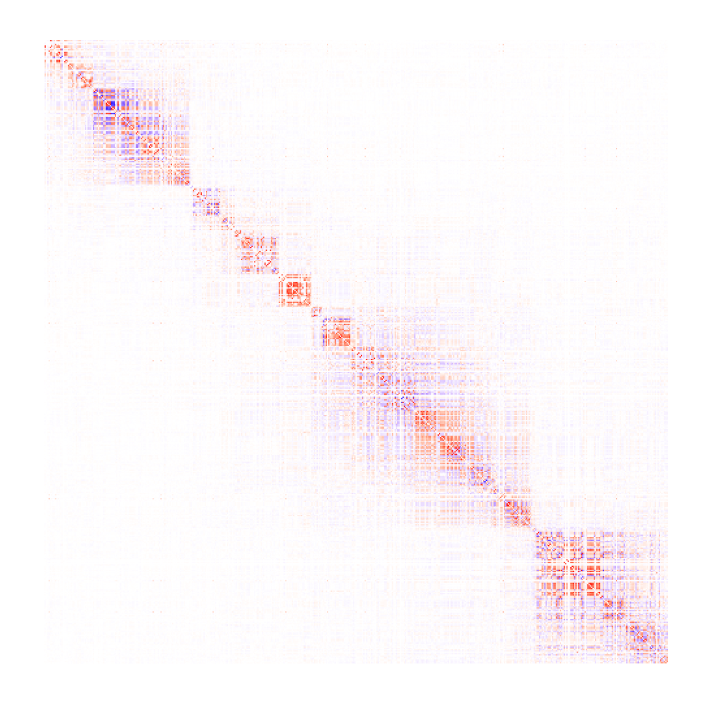

# Estimating Linkage Disequilibrium within a multi-ethnic cohort

## Introduction

Linkage disequilibrium (LD) quantifies the degree of non-random
association between alleles at different loci within a population. The
estimation of LD in multi-ethnic cohorts, however, can be challenging
due to the underlying population structure. The
[`computeLD()`](https://github.com/statsleelab/gauss/reference/computeLD.md)
function in the GAUSS package addresses this challenge by offering an
efficient and accurate method to estimate LD, factoring in the mixed
ancestries present in the cohort. This vignette will provide you a
step-by-step guide on using
[`computeLD()`](https://github.com/statsleelab/gauss/reference/computeLD.md)
for estimating LD for SNPs within a multi-ethnic Schizophrenia GWAS
cohort.

## Load necessary packages

``` r

# Load necessary packages
library(gauss)
library(reshape2)
library(tidyverse)
library(data.table)
library(kableExtra)
```

## Overview of computeLD()

The
[`computeLD()`](https://github.com/statsleelab/gauss/reference/computeLD.md)
function in the GAUSS package is designed to estimate Linkage
Disequilibrium (LD) by leveraging the observed or estimated ancestry
proportions of a target cohort. It calculates LD for specific genomic
regions as a weighted sum of LD values across various ancestries. The LD
values for each ancestry are estimated from a reference panel. In this
example, we utilize [the 33KG reference
panel](https://statsleelab.github.io/gauss/articles/ref_33KG.html) for
our estimations.

The function requires following arguments:

- `chr`: Chromosome number.
- `start_bp`: Starting base pair position of the estimation window.
- `end_bp`: Ending base pair position of the estimation window.
- `pop_wgt_df`: R data frame containing population IDs and wights
- `input_file`: File name of the association Z-score data
- `reference_index_file`: File name of reference panel index data
- `reference_data_file`: File name of reference panel data
- `reference_pop_desc_file`: File name of reference panel population
  description data
- `af1_cutff`: Cutoff of reference allele (a1) frequency

The
[`computeLD()`](https://github.com/statsleelab/gauss/reference/computeLD.md)
function returns a list with two elements:

- `snplist`: A data frame containing information on the SNPs used in the
  LD estimation.
- `cormat`: A matrix of LD estimates for each pair of SNPs.

## Preparing the Input Data

### Ancestry Proportion Data

The ancestry proportion data `pop_wgt_df` should include two columns
with the following names: pop (population abbreviation) wgt (weight or
proportion). This information should be estimated using the
[`afmix()`](https://github.com/statsleelab/gauss/reference/afmix.md)
function as described
[here](https://statsleelab.github.io/gauss/articles/afmix_example.html).

Here, we load the ancestry proportion data generated from the
[vignette](https://statsleelab.github.io/gauss/articles/afmix_example.html)
for [`afmix()`](https://github.com/statsleelab/gauss/reference/afmix.md)
function:

``` r

# Load the ancestry proportion data
data("PGC2_SCZ_ANC_Prop") # data frame name: PGC2_SCZ_ANC_Prop
head(PGC2_SCZ_ANC_Prop)
#>   pop   wgt
#> 1 ACB 0.006
#> 2 ASW 0.036
#> 3 BEB 0.005
#> 4 CCE 0.008
#> 5 CCS 0.004
#> 6 CDX 0.018
```

### Association Z-score Data

The association Z-score data file should be a space-delimited text file
including six columns with the following names: `rsid` (SNP ID), `chr`
(chromosome number), `bp` (base pair position), `a1` (reference allele),
`a2` (alternative allele), and `z` (association Z-score).

We assign the path to the association Z-score data file here:

``` r

# Define the path to the input file
input_file <- "../data/PGC2_3Mb.txt"

# Input file should include six columns (rsid, chr, bp, a1, a2, and z)
input_data <- fread(input_file, header = TRUE)
head(input_data)
#>          rsid   chr        bp     a1     a2         z
#>        <char> <int>     <int> <char> <char>     <num>
#> 1:  rs1004467    10 104594507      A      G  6.686674
#> 2:  rs1008013    10 103548866      A      T -1.769923
#> 3: rs10128116    10 103717613      A      G -1.883298
#> 4:  rs1015037    10 105547517      T      G -1.917614
#> 5: rs10159775    10 103184297      A      G  1.304979
#> 6: rs10159838    10 105473937      A      G  2.582526
```

### Reference Panel Data Files

Next, we assign the paths to reference panel data files:

``` r

# Paths to the reference files (replace these with your actual paths)
reference_index_file <-"../ref/33KG/33kg_index.gz"
reference_data_file <- "../ref/33KG/33kg_geno.gz"
reference_pop_desc_file<-"../ref/33KG/33kg_pop_desc.txt"
```

## Running computeLD()

With the necessary arguments and data prepared, we can now estimate the
Linkage Disequilibrium for a specific genomic region using the
[`computeLD()`](https://github.com/statsleelab/gauss/reference/computeLD.md)
function. For this example, we focus on a 1Mb genomic region located at
Chromosome 10: 104-105 Mb.

``` r

af1_cutoff = 0.001

res <- computeLD(chr=10, 
                 start_bp = 104000001, 
                 end_bp = 105000000,
                 pop_wgt_df = PGC2_SCZ_ANC_Prop,
                 input_file = input_file, 
                 reference_index_file = reference_index_file,
                 reference_data_file = reference_data_file, 
                 reference_pop_desc_file = reference_pop_desc_file,
                 af1_cutoff = af1_cutoff)
```

## Examining the Results

Let’s display the first few entries of the results:

``` r

head(res$snplist) %>% kable("html")
```

| rsid       | chr |        bp | a1  | a2  |    af1mix |
|:-----------|----:|----------:|:----|:----|----------:|
| rs3758549  |  10 | 104004195 | A   | G   | 0.1928059 |
| rs1541046  |  10 | 104005386 | A   | G   | 0.6625196 |
| rs2296887  |  10 | 104005410 | C   | T   | 0.1591055 |
| rs10748818 |  10 | 104015279 | G   | A   | 0.1664600 |
| rs1628530  |  10 | 104029307 | C   | A   | 0.1235526 |
| rs17114433 |  10 | 104043015 | G   | A   | 0.0247393 |

``` r

head(res$cormat[1:3,1:3])
#>            [,1]      [,2]       [,3]
#> [1,]  1.0000000 0.3862754 -0.2043553
#> [2,]  0.3862754 1.0000000  0.3080552
#> [3,] -0.2043553 0.3080552  1.0000000
```

Finally, we generate a heatmap to visually represent the LD estimates:

``` r

cormat <- res$cormat
diag(cormat) <- NA
cormelt <- reshape2::melt(cormat, na.rm = TRUE)

p1 <- ggplot(data = cormelt, aes(x = Var1, y = Var2, fill = value)) +
  geom_tile() +
  scale_fill_gradient2(low = "blue", high = "red", 
                       mid = "white", 
                       midpoint = 0, limit = c(-1,1), 
                       space = "Lab") +
  scale_y_reverse() +
  theme_minimal() + 
  theme(axis.text.x = element_blank(),
        axis.text.y = element_blank(),
        axis.ticks = element_blank(),
        axis.title.x = element_blank(),
        axis.title.y = element_blank(),
        panel.grid.major = element_blank(),
        panel.grid.minor = element_blank(),
        legend.position = "none") +
  coord_fixed()

p1
```



``` r


#ggsave(file="docs/figure/computeLD_example.pdf", p1)
```

## References

- Lee et al. DISTMIX: direct imputation of summary statistics for
  unmeasured SNPs from mixed ethnicity cohorts. Bioinformatics.
  <https://doi.org/10.1093/bioinformatics/btv348>.
- Lee and Bacanu. GAUSS: a summary-statistics-based R package for
  accurate estimation of linkage disequilibrium for variants, Gaussian
  imputation, and TWAS analysis of cosmopolitan cohorts. Bioinformatics.
  <https://doi.org/10.1093/bioinformatics/btae203>.
