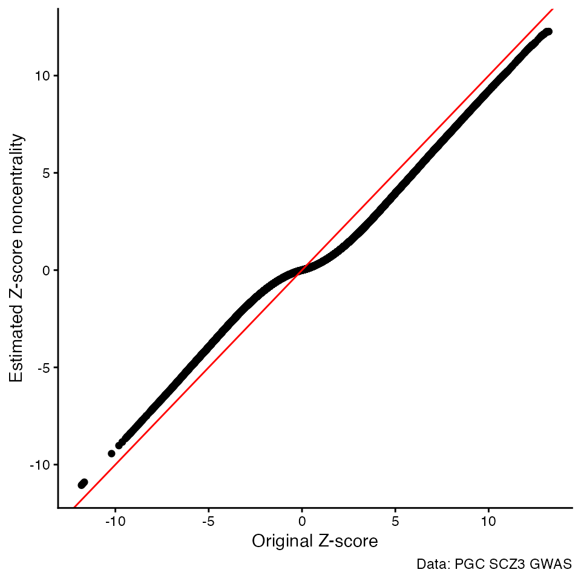

# Winner's curse adjustment

## Introduction

In many genetic association studies that involve extensive multiple
testing, it’s often observed that association signals below the
statistical significance threshold have a greater impact on trait
variation than those that are statistically significant. Accurately
quantifying these sub-threshold effects is crucial but challenging due
to biases known as the “Winner’s Curse.” In previous work, we developed
FIQT (FDR Inverse Quantile Transformation), a straightforward technique
to correct for these biases. Initially, FIQT uses the False Discovery
Rate (FDR) to correct the p-values of SNP associations for multiple
testing. It then derives the Z-score noncentrality estimates based on
the Gaussian quantiles that correspond to these adjusted p-values, while
maintaining the correct sign. The FIQT approach has been conveniently
incorporated into the GAUSS package as the
[`fiqt()`](https://github.com/statsleelab/gauss/reference/fiqt.md)
function. By simply entering a Z-score vector along with the minimum
non-zero p-value generated by the qnorm() function (default value is
10^-320), this function will produce a Z-score vector that has been
adjusted to account for the winner’s curse biases.

## Load necessary packages

``` r

library(gauss)
#> 
#> Attaching package: 'gauss'
#> The following object is masked from 'package:stats':
#> 
#>     dist
library(tidyverse)
#> ── Attaching core tidyverse packages ──────────────────────── tidyverse 2.0.0 ──
#> ✔ dplyr     1.1.4     ✔ readr     2.1.6
#> ✔ forcats   1.0.1     ✔ stringr   1.6.0
#> ✔ ggplot2   4.0.1     ✔ tibble    3.3.0
#> ✔ lubridate 1.9.4     ✔ tidyr     1.3.2
#> ✔ purrr     1.2.0
#> ── Conflicts ────────────────────────────────────────── tidyverse_conflicts() ──
#> ✖ dplyr::filter() masks stats::filter()
#> ✖ dplyr::lag()    masks stats::lag()
#> ℹ Use the conflicted package (<http://conflicted.r-lib.org/>) to force all conflicts to become errors
library(data.table)
#> 
#> Attaching package: 'data.table'
#> 
#> The following objects are masked from 'package:lubridate':
#> 
#>     hour, isoweek, isoyear, mday, minute, month, quarter, second, wday,
#>     week, yday, year
#> 
#> The following objects are masked from 'package:dplyr':
#> 
#>     between, first, last
#> 
#> The following object is masked from 'package:purrr':
#> 
#>     transpose
library(kableExtra)
#> 
#> Attaching package: 'kableExtra'
#> 
#> The following object is masked from 'package:dplyr':
#> 
#>     group_rows
```

## Example

In this example, we’ll correct for the “Winner’s Curse” bias using the
fiqt() function applied to summary statistics from the Psychiatric
Genomics Consortium Schizophrenia Phase 3 study. For demonstration
purposes, we have limited our analysis to SNPs from the Illumina 1M Chip
only.

``` r

input_file <- "../data/PGC3_SCZ_ilmn1M_Z.txt"
pgc3 <- fread(input_file)
head(pgc3)
#>          rsid   chr        bp     a1     a2          z
#>        <char> <int>     <int> <char> <char>      <num>
#> 1:  rs1000000    12 126890980      G      A  1.9203001
#> 2: rs10000006     4 108826383      T      C -2.3233567
#> 3:  rs1000002     3 183635768      C      T  1.2342762
#> 4: rs10000021     4 159441457      G      T -0.7111359
#> 5: rs10000023     4  95733906      G      T -2.0628172
#> 6:  rs1000003     3  98342907      A      G -1.0814432
```

### Running fiqt()

``` r

pgc3$z.wca <- fiqt(pgc3$z)
```

### Results

``` r

head(pgc3) %>% kable("html")
```

| rsid       | chr |        bp | a1  | a2  |          z |      z.wca |
|:-----------|----:|----------:|:----|:----|-----------:|-----------:|
| rs1000000  |  12 | 126890980 | G   | A   |  1.9203001 |  0.9662015 |
| rs10000006 |   4 | 108826383 | T   | C   | -2.3233567 | -1.2816898 |
| rs1000002  |   3 | 183635768 | C   | T   |  1.2342762 |  0.5112610 |
| rs10000021 |   4 | 159441457 | G   | T   | -0.7111359 | -0.2436473 |
| rs10000023 |   4 |  95733906 | G   | T   | -2.0628172 | -1.0743353 |
| rs1000003  |   3 |  98342907 | A   | G   | -1.0814432 | -0.4263369 |

### Original Z-scores vs FIQT Z-score noncentrality estimates

``` r

ggplot() +
  geom_point(aes(x=z, y=z.wca), data=pgc3) +
  geom_abline(intercept = 0, slope = 1, color="red") +
  labs(x="Original Z-score",
      y="Estimated Z-score noncentrality",
      caption="Data: PGC SCZ3 GWAS") +
  theme_classic()
```



## Reference

- Bigdeli et al. A simple yet accurate correction for winner’s curse can
  predict signals discovered in much larger genome scans.
  Bioinformatics. 2016 Sep 1;32(17):2598-603. doi:
  10.1093/bioinformatics/btw303.
